# copilot_here: A Secure, Portable Copilot CLI Environment

Run the GitHub Copilot CLI from any directory on your machine, inside a sandboxed Docker container that automatically uses your existing `gh` authentication.

[](https://github.com/GordonBeeming/copilot_here/actions/workflows/publish.yml)

## 🚀 What is this?

This project solves a simple problem: you want to use the awesome [GitHub Copilot CLI](https://github.com/features/copilot/cli), but you also want a clean, portable, and secure environment for it.

The `copilot_here` shell function is a lightweight wrapper around a Docker container. When you run it in a terminal, it:
- **Enhances security** by isolating the tool in a container, granting it file system access **only** to the directory you're currently in. 🛡️
- **Keeps your machine clean** by avoiding a global Node.js installation.
- **Authenticates automatically** by using your host machine's existing `gh` CLI credentials.
- **Validates token permissions** by checking for required scopes and warning you about overly permissive tokens.
- **Persists its configuration**, so it remembers which folders you've trusted across sessions.
- **Stays up-to-date** by automatically pulling the latest image version on every run.

## ✅ Prerequisites

Before you start, make sure you have the following installed and configured on your machine:
- [Docker Desktop](https://www.docker.com/products/docker-desktop/) (or Docker Engine on Linux).
- The [GitHub CLI (`gh`)](https://cli.github.com/).
- You must be logged in to the GitHub CLI. You can check by running `gh auth status`. Your token **must** have the `copilot` and `read:packages` scopes. If it doesn't, run `gh auth refresh -h github.com -s copilot,read:packages` to add them.

## 🛠️ Setup Instructions

Choose your platform below. The scripts include both **Safe Mode** (asks for confirmation) and **YOLO Mode** (auto-approves) functions. You can use either or both depending on your needs.

### Execution Modes

**Safe Mode (`copilot_here`)** - Always asks for confirmation before executing commands. Recommended for general development work where you want control over what gets executed.

**YOLO Mode (`copilot_yolo`)** - Automatically approves all tool usage without confirmation. Convenient for trusted workflows but use with caution as it can execute commands without prompting.

### Image Variants

All images support both **AMD64** (x86_64) and **ARM64** (Apple Silicon, etc.) architectures.

All functions support switching between Docker image variants using flags:
- **No flag** - Base image (Node.js, Git, basic tools)
- **`--dotnet`** (`-d`) - .NET image (includes .NET 8, 9 & 10 SDKs)
- **`--dotnet8`** (`-d8`) - .NET 8 image (includes .NET 8 SDK)
- **`--dotnet9`** (`-d9`) - .NET 9 image (includes .NET 9 SDK)
- **`--dotnet10`** (`-d10`) - .NET 10 image (includes .NET 10 SDK)
- **`--playwright`** (`-pw`) - Playwright image (includes browser automation)
- **`--dotnet-playwright`** (`-dp`) - .NET + Playwright image (includes browser automation)
- **`--rust`** (`-rs`) - Rust image (includes Rust toolchain)
- **`--dotnet-rust`** (`-dr`) - .NET + Rust image

### Additional Options

- **`-h` or `--help`** - Show usage help and examples
- **`--no-cleanup`** - Skip cleanup of unused Docker images
- **`--no-pull`** - Skip pulling the latest image
- **`--mount <path>`** - Mount a directory as read-only
- **`--mount-rw <path>`** - Mount a directory as read-write
- **`--save-mount <path>`** - Save a mount to local config
- **`--save-mount-global <path>`** - Save a mount to global config
- **`--remove-mount <path>`** - Remove a saved mount
- **`--list-mounts`** - List all configured mounts
- **`--update`** (`-u`) - Update from GitHub repository

### Copilot CLI Options

These options are passed directly to the GitHub Copilot CLI:
- **`-p <prompt>` or `--prompt <prompt>`** - Execute a prompt directly
- **`--model <model>`** - Set AI model (e.g., `claude-sonnet-4.5`, `gpt-5`)
- **`--continue`** - Resume most recent session
- **`--resume <sessionId>`** - Resume from a previous session
- **`--help2`** - Show GitHub Copilot CLI native help

> ⚠️ **Security Note:** Both modes check for proper GitHub token scopes and warn about overly privileged tokens.

### Directory Mounting

By default, `copilot_here` only mounts the current working directory. You can mount additional directories using flags or configuration files.

**CLI Flags:**
- `--mount ./path/to/dir` (Read-only)
- `--mount-rw ./path/to/dir` (Read-write)

**Configuration Files:**
- Global: `~/.config/copilot_here/mounts.conf`
- Local: `.copilot_here/mounts.conf`

**Format:** `path/to/dir:ro` or `path/to/dir:rw` (one per line)

**Management Commands:**
Use `--save-mount`, `--save-mount-global`, `--remove-mount`, and `--list-mounts` to manage persistent mounts.

### Image Management

You can configure the default image tag to use (e.g., `dotnet`, `dotnet-playwright`, or a specific SHA) so you don't have to pass flags every time.

**Management Commands:**
- `--list-images` - List all available Docker images
- `--show-image` - Show current default image configuration
- `--set-image <tag>` - Set default image in local config
- `--set-image-global <tag>` - Set default image in global config
- `--clear-image` - Clear default image from local config
- `--clear-image-global` - Clear default image from global config

**Configuration Files:**
- Global: `~/.config/copilot_here/image.conf`
- Local: `.copilot_here/image.conf`

### Custom Docker Flags (SANDBOX_FLAGS)

Pass additional Docker flags using the `SANDBOX_FLAGS` environment variable (compatible with Gemini CLI):

**Examples:**

```bash
# Use host networking
export SANDBOX_FLAGS="--network host"
copilot_here

# Pass environment variables to the container
export SANDBOX_FLAGS="--env DEBUG=1 --env LOG_LEVEL=trace"

# Multiple flags (space-separated)
export SANDBOX_FLAGS="--network my-net --cap-add SYS_PTRACE"

# Resource limits
export SANDBOX_FLAGS="--memory 2g --cpus 1.5"

# Per-command override (doesn't set globally)
SANDBOX_FLAGS="--network dev" copilot_here
```

**Supported Flags:**
- `--network <name>` - Connect to a custom Docker network
- `--env <KEY=value>` - Set environment variables
- `--cap-add <capability>` - Add Linux capabilities
- `--cap-drop <capability>` - Drop Linux capabilities
- `--memory <limit>` - Set memory limit (e.g., `2g`, `512m`)
- `--cpus <number>` - Set CPU limit (e.g., `1.5`)
- `--ulimit <type>=<limit>` - Set ulimits (e.g., `nofile=1024`)

**Airlock Mode:**
When using `--enable-airlock`, the `--network` flag changes the proxy's external network while maintaining app container isolation. The app container remains on the internal airlock network and can only access the proxy, which then routes to your specified network.

```bash
# Example: Proxy connects to custom network while app stays isolated
docker network create my-services
SANDBOX_FLAGS="--network my-services" copilot_here --enable-airlock
```

### 🛡️ Airlock (Network Isolation)

Airlock provides an additional layer of security by routing all network traffic from the Copilot CLI through a proxy that enforces an allowlist of permitted hosts and paths. This ensures that the AI can only communicate with approved endpoints.

**Key Features:**
- **Enforce Mode**: Blocks all network requests not matching the allowlist
- **Monitor Mode**: Logs all network activity without blocking (useful for auditing)
- **Configurable Rules**: Define allowed hosts and paths per-project or globally
- **Automatic Logging**: Monitor mode automatically enables request logging
- **Inherit Default Rules**: Optionally inherit rules from updates for easier maintenance

**Setup Commands:**
- `--enable-airlock` - Enable Airlock for current project
- `--enable-global-airlock` - Enable Airlock globally
- `--disable-airlock` - Disable Airlock for current project
- `--disable-global-airlock` - Disable Airlock globally

**Management Commands:**
- `--show-airlock-rules` - Display current Airlock configuration
- `--edit-airlock-rules` - Edit local Airlock rules in $EDITOR
- `--edit-global-airlock-rules` - Edit global Airlock rules in $EDITOR

**Configuration Files:**
- Global: `~/.config/copilot_here/network.json`
- Local: `.copilot_here/network.json`
- Default Rules: `~/.config/copilot_here/default-airlock-rules.json` (updated with script updates)

**Example Configuration:**
```json
{
  "enabled": true,
  "inherit_default_rules": true,
  "mode": "enforce",
  "enable_logging": false,
  "allowed_rules": [
    {
      "host": "api.github.com",
      "allowed_paths": ["/user", "/graphql"]
    },
    {
      "host": "api.individual.githubcopilot.com",
      "allowed_paths": ["/models", "/mcp/readonly", "/chat/completions"]
    }
  ]
}
```

**Modes:**
- **enforce** (`e`): Blocks requests not matching the allowlist
- **monitor** (`m`): Allows all requests but logs them for review

When enabling Airlock for the first time, you'll be prompted to choose between enforce and monitor mode.

**Logging:**
When `enable_logging` is true (or in monitor mode), request logs are saved to `.copilot_here/logs/` (excluded from git by default).

**Network Topology View**

```mermaid
graph LR
    subgraph Docker_Host [🐳 Docker Host]
        style Docker_Host fill:#F8F9FA,stroke:#1A1A1A,color:#1A1A1A
        
        subgraph Airlock_Net [🔒 Network: airlock_net]
            style Airlock_Net fill:#E9ECEF,stroke:#1A1A1A,stroke-width:2px,stroke-dasharray: 5 5,color:#1A1A1A
            
            App[("🤖 Copilot Container<br/>(Single Homed)")]
            style App fill:#FFFFFF,stroke:#0063B2,stroke-width:2px,color:#1A1A1A
            
            ProxyInt["Proxy Interface<br/>(eth0)"]
            style ProxyInt fill:none,stroke:none,color:#1A1A1A
        end

        subgraph Proxy_Container [🛡️ Secure Proxy Container]
            style Proxy_Container fill:#46CBFF,stroke:#0063B2,stroke-width:3px,color:#1A1A1A
            ProxyApp["Proxy Process"]
            style ProxyApp fill:#F8F9FA,stroke:#0063B2,color:#1A1A1A
        end

        App == "1. Traffic via Airlock" ==> ProxyApp
    end

    Internet((☁️ Internet / GitHub))
    style Internet fill:#F8F9FA,stroke:#1A1A1A,stroke-width:2px,color:#1A1A1A

    ProxyApp == "2. Traffic via Bridge" ==> Internet

    linkStyle 0 stroke:#0063B2,stroke-width:3px,color:#0063B2
    linkStyle 1 stroke:#0063B2,stroke-width:3px,color:#0063B2
```



1.  **🔒 The Sealed Chamber (Airlock Network):**
    The `copilot_here` container is launched into a private, internal-only network. It has **zero** direct access to the internet. If an application tries to bypass the proxy, the connection simply fails because there is no route out.

2.  **🛡️ The Sentry (Secure Proxy):**
    The Proxy is the only component with a "key" to the outside world. It sits with one foot in the Airlock (to listen for requests) and one foot in the Bridge network (to reach GitHub).

3.  **✅ The Controlled Exit:**
    Traffic can only leave the Airlock if it explicitly asks the Proxy to carry it. The Proxy inspects the destination against your allow-list and decides whether to let the request pass or block it.


### For Linux/macOS (Bash/Zsh)

**Quick Install (Recommended):**

If you already have the `copilot_here` binary on your PATH, you can install shell integrations for bash/zsh/fish (and on Windows: PowerShell + cmd) with:

```bash
copilot_here --install-shells
```

Otherwise, download and source the script in your shell profile:

```bash
# Download the script (from latest release)
curl -fsSL https://github.com/GordonBeeming/copilot_here/releases/download/cli-latest/copilot_here.sh -o ~/.copilot_here.sh

# Add to your shell profile (~/.zshrc or ~/.bashrc) - only if not already there
if ! grep -q "source ~/.copilot_here.sh" ~/.zshrc 2>/dev/null; then
  echo '' >> ~/.zshrc
  echo 'source ~/.copilot_here.sh' >> ~/.zshrc
fi

# Reload your shell
source ~/.zshrc  # or source ~/.bashrc
```

To update later, just run: `copilot_here --update`


**Manual Install (Alternative):**

If you prefer not to use the quick install method, you can manually copy the script file:

1. **Download the script:**
   ```bash
   curl -fsSL https://github.com/GordonBeeming/copilot_here/releases/download/cli-latest/copilot_here.sh -o ~/.copilot_here.sh
   ```

2. **Add to your shell profile** (`~/.zshrc` or `~/.bashrc`):
   ```bash
   source ~/.copilot_here.sh
   ```

3. **Reload your shell:**
   ```bash
   source ~/.zshrc  # or source ~/.bashrc
   ```

**Note:** If you want to disable the auto-update functionality, you can remove the `--update-scripts` and `--upgrade-scripts` case blocks from the downloaded script file.


### For Windows (PowerShell)

**Quick Install (Recommended):**

Download and source the script in your PowerShell profile:

```powershell
# Download the script (from latest release)
$scriptPath = "$env:USERPROFILE\.copilot_here.ps1"
Invoke-WebRequest -Uri "https://github.com/GordonBeeming/copilot_here/releases/download/cli-latest/copilot_here.ps1" -OutFile $scriptPath

# Create profile if it doesn't exist, then add script reference
if (-not (Test-Path $PROFILE)) { New-Item -ItemType File -Path $PROFILE -Force | Out-Null }
if (-not (Select-String -Path $PROFILE -Pattern "copilot_here.ps1" -Quiet -ErrorAction SilentlyContinue)) {
    Add-Content $PROFILE "`n. $scriptPath"
}

# Reload your profile
. $PROFILE
```

To update later, just run: `copilot_here --update`


**Manual Install (Alternative):**

If you prefer not to use the quick install method, you can manually copy the script file:

1. **Download the script:**
   ```powershell
   $scriptPath = "$env:USERPROFILE\Documents\PowerShell\copilot_here.ps1"
   New-Item -ItemType Directory -Path (Split-Path $scriptPath) -Force | Out-Null
   Invoke-WebRequest -Uri "https://github.com/GordonBeeming/copilot_here/releases/download/cli-latest/copilot_here.ps1" -OutFile $scriptPath
   ```

2. **Add to your PowerShell profile:**
   ```powershell
   # Create profile if it doesn't exist
   if (-not (Test-Path $PROFILE)) { New-Item -ItemType File -Path $PROFILE -Force | Out-Null }
   # Add this line to your PowerShell profile
   Add-Content $PROFILE "`n. `"$env:USERPROFILE\Documents\PowerShell\copilot_here.ps1`""
   ```
   
   Or manually edit your profile:
   ```powershell
   notepad $PROFILE
   ```

3. **Reload your PowerShell profile:**
   ```powershell
   . $PROFILE
   ```

**Note:** The auto-update functionality can be removed by editing the downloaded script file.


## Usage

Once set up, using it is simple on any platform. All commands work identically on Linux, macOS, and Windows.

### Interactive Mode

Start a full chat session with the welcome banner:

```bash
# Base image (default)
copilot_here

# With .NET image
copilot_here --dotnet

# With .NET + Playwright image
copilot_here --dotnet-playwright

# With Rust image
copilot_here --rust

# Get help
copilot_here --help
copilot_yolo --help
```

### Non-Interactive Mode

Pass a prompt directly to get a quick response.

**Safe Mode** (asks for confirmation before executing):

```bash
# Base image
copilot_here "suggest a git command to view the last 5 commits"
copilot_here "explain the code in ./my-script.js"

# .NET image
copilot_here --dotnet "build and test this .NET project"
copilot_here --dotnet "explain this C# code"

# .NET + Playwright image
copilot_here --dotnet-playwright "run playwright tests for this app"

# Skip cleanup and pull for faster startup
copilot_here --no-cleanup --no-pull "quick question about this code"

# Use specific model
copilot_here --model claude-sonnet-4.5 "explain this algorithm"
```

### Accessing Session Information

Inside any copilot_here container, you can view detailed information about your session:

```bash
# View formatted session info (image, mounts, mode, etc.)
session-info

# Or manually format with Python (works in all images without rebuild)
echo $COPILOT_HERE_SESSION_INFO | python3 -m json.tool

# View raw JSON
echo $COPILOT_HERE_SESSION_INFO

# Query specific fields with jq
echo $COPILOT_HERE_SESSION_INFO | jq .image.tag
echo $COPILOT_HERE_SESSION_INFO | jq .mounts
echo $COPILOT_HERE_SESSION_INFO | jq .airlock.network_config  # If airlock enabled
```

The `COPILOT_HERE_SESSION_INFO` environment variable contains:
- **Version**: copilot_here build version
- **Image**: Tag and full image name
- **Mode**: "standard" or "yolo"
- **Working Directory**: Container working directory path
- **Mounts**: All mounted paths with their modes (ro/rw) and sources
- **Airlock**: Network proxy status and configuration (if enabled)

This makes it easy for AI assistants to understand the environment without scrolling through startup logs.

> **Note:** The `session-info` command will be available in containers after the next image rebuild. Until then, use `echo $COPILOT_HERE_SESSION_INFO | python3 -m json.tool` for formatted output.

**YOLO Mode** (auto-approves execution):

```bash
# Base image
copilot_yolo "write a function that reverses a string"
copilot_yolo "run the tests and fix any failures"

# .NET image
copilot_yolo --dotnet "create a new ASP.NET Core API project"
copilot_yolo --dotnet "add unit tests for this controller"

# .NET + Playwright image
copilot_yolo --dotnet-playwright "write playwright tests for the login page"

# Skip cleanup for faster execution
copilot_yolo --no-cleanup "generate a README for this project"
```


## 🐳 Docker Image Variants

This project provides multiple Docker image variants for different development scenarios. All images include the GitHub Copilot CLI and inherit the base security and authentication features.

### Available Images

| Tag | Flag | Description |
|-----|------|-------------|
| `latest` | *(default)* | Base image with Node.js 20, Git, and essential tools |
| `dotnet` | `--dotnet` | .NET 8, 9 & 10 SDKs |
| `dotnet-8` | `--dotnet8` | .NET 8 SDK only |
| `dotnet-9` | `--dotnet9` | .NET 9 SDK only |
| `dotnet-10` | `--dotnet10` | .NET 10 SDK only |
| `playwright` | `--playwright` | Playwright with Chromium browser |
| `dotnet-playwright` | `--dotnet-playwright` | .NET + Playwright combined |
| `rust` | `--rust` | Rust toolchain |
| `dotnet-rust` | `--dotnet-rust` | .NET + Rust combined |

### Choosing the Right Image

- Use **`latest`** for general development, scripting, and Node.js projects
- Use **`dotnet`** when working with .NET projects without browser testing needs
- Use **`playwright`** when working with Node.js projects that need browser automation
- Use **`dotnet-playwright`** when you need both .NET and browser automation capabilities
- Use **`rust`** for Rust development
- Use **`dotnet-rust`** for projects combining .NET and Rust

## 💻 Supported Systems

| Operating System | Shell | Supported | Tested |
|-----------------|-------|-----------|--------|
| **macOS** | Zsh | ✅ | ✅ |
| **macOS** | Bash | ✅ | |
| **Linux** | Bash | ✅ | |
| **Linux** | Zsh | ✅ | |
| **Windows 10/11** | PowerShell 5.1 | ✅ | ✅ |
| **Windows 10/11** | PowerShell 7+ | ✅ | |

> **Note:** "Tested" represents systems personally tested by the maintainer. The tool likely works on other compatible systems too, but hasn't been verified yet. If you successfully use it on an untested configuration, please let us know!

## 📚 Documentation

- [Docker Images Documentation](docs/docker-images.md) - Details about available image variants
- [Known Issues](docs/known-issues.md) - Known issues, limitations, and workarounds
- [CLI Icon Legend](docs/icon-legend.md) - Meaning of icons in CLI output
- [Migration Guide](docs/migration-to-native-binary.md) - Details about the native binary implementation
- [Task Documentation](docs/tasks/) - Development task history and changes

## 📜 License

This project is licensed under the MIT License.
