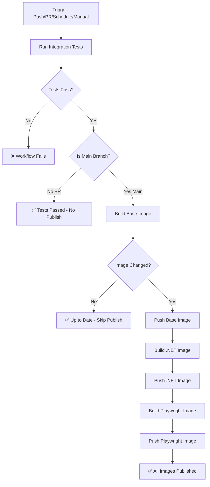

# CI/CD Pipeline Documentation

## Overview

The copilot_here project uses GitHub Actions for continuous integration and deployment with a **test-first** approach. All code changes must pass tests before images can be built or published.

## Workflows

### Integration Tests (`test.yml`)

**Triggers:**
- Push to `main` branch
- Pull requests to `main`  
- Manual dispatch (`workflow_dispatch`)

**Test Matrix:**
- **Linux/macOS:** Bash, Zsh, PowerShell (all tests via `run_all_tests.sh`)
- **Windows:** PowerShell integration + basic tests

**What Gets Tested:**
- Function definitions and loading
- Config file parsing (comments, whitespace, paths)
- Path resolution (tilde expansion, relative/absolute)
- Docker command generation (mocking without execution)
- Mount configuration validation
- Cross-shell compatibility

### Build and Publish (`publish.yml`)

**Triggers:**
- Push to `main` branch
- Pull requests to `main` (tests only, no publish)
- Nightly schedule (3:15 AM UTC)
- Manual dispatch (`workflow_dispatch`)

**Pipeline Flow:**



**Key Behaviors:**

1. **Tests Always Run:** Every trigger (push, PR, schedule, manual) runs full test suite first
2. **Publishing is Conditional:**
   - **PRs:** Tests run, but images are NOT published (security + avoid unnecessary builds)
   - **Main Branch:** Tests + Build + Publish (if changes detected)
   - **Schedule/Manual:** Tests + Build + Publish (if changes detected)
3. **Smart Publishing:** Only publishes if:
   - Triggered by push to main, OR
   - Image digest changed (new Copilot CLI version or Dockerfile changes)

## Published Images

All images are published to GitHub Container Registry (`ghcr.io`):

1. **Base Image:** `ghcr.io/gordonbeeming/copilot_here:latest`
   - Node.js 20 + GitHub Copilot CLI
   - Tags: `latest`, `main`, `sha-<commit>`

2. **.NET Image:** `ghcr.io/gordonbeeming/copilot_here:dotnet`
   - Base image + .NET 8 & 9 SDKs + Playwright
   - Tags: `dotnet`, `dotnet-sha-<commit>`

3. **Playwright Image:** `ghcr.io/gordonbeeming/copilot_here:dotnet-playwright`
   - .NET image + Chromium browser dependencies
   - Tags: `dotnet-playwright`, `dotnet-playwright-sha-<commit>`

## Running Tests Locally

### All Tests (Recommended)
```bash
./tests/run_all_tests.sh
```

### Individual Test Suites
```bash
# Bash tests
bash tests/integration/test_bash.sh

# Zsh tests  
zsh tests/integration/test_zsh.sh

# PowerShell tests
pwsh tests/integration/test_powershell_basic.ps1

# Docker command tests (Bash)
bash tests/integration/test_docker_commands.sh

# Mount config tests (Bash)
bash tests/integration/test_mount_config.sh
```

## Test Requirements

### For Pull Requests
- ✅ All integration tests must pass
- ✅ Tests run on Linux, macOS, and Windows
- ✅ No images are published (tests only)

### For Main Branch Merges
- ✅ All integration tests must pass
- ✅ Images are built after tests pass
- ✅ Images are published if changes detected

### For Manual Runs
- ✅ Tests can be run from any branch via `workflow_dispatch`
- ✅ Publishing only happens if triggered from main branch

## Debugging Failed Workflows

### Test Failures

1. Check the **Integration Tests** workflow run
2. Expand the failing job (Linux/macOS/Windows)
3. Review test output to identify failing test
4. Run the specific test locally to reproduce
5. Fix the issue and push changes

### Build Failures

1. Ensure tests are passing (build won't run without passing tests)
2. Check Dockerfile syntax if build step fails
3. Verify base image dependencies are available
4. Check Docker build logs for specific errors

## Security Notes

- **Tests run on PRs from forks** - no secrets exposed during testing
- **Publishing requires write access** - only happens on main branch
- **GITHUB_TOKEN** has minimal permissions - can only write to packages
- **No secrets in test environment** - test mode bypasses auth checks

## Performance Optimizations

- **Docker layer caching** - Reuses layers from previous builds
- **Conditional publishing** - Only publishes when changes detected
- **Parallel testing** - Linux/macOS/Windows tests run simultaneously
- **Smart cache invalidation** - Uses Copilot CLI version to trigger rebuilds

## Maintenance

### Updating Test Coverage

When adding new tests:
1. Add test to appropriate file (`test_bash.sh`, `test_zsh.sh`, etc.)
2. Ensure `run_all_tests.sh` includes the new test
3. Update this documentation if adding new test categories

### Updating Workflows

When modifying workflows:
1. Test changes on a feature branch first
2. Use `workflow_dispatch` to trigger manually
3. Verify tests pass before merging to main
4. Document any new behaviors in this file

## Troubleshooting

### "Tests Required but Failing"
- Run tests locally: `./tests/run_all_tests.sh`
- Check which specific test is failing
- Fix the test or the code being tested

### "Image Not Publishing"
- Ensure you're on main branch (`git branch`)
- Check if image changed (digest comparison in logs)
- Verify GITHUB_TOKEN has package write permission

### "Workflow Not Triggering"
- Check `.github/workflows/` files for syntax errors
- Ensure branch name matches trigger conditions
- Verify repository settings allow Actions to run

## Future Enhancements

- [ ] Add code coverage reporting
- [ ] Implement test result caching
- [ ] Add performance benchmarks
- [ ] Create test matrix for multiple Copilot CLI versions
- [ ] Add integration tests for actual Docker execution
