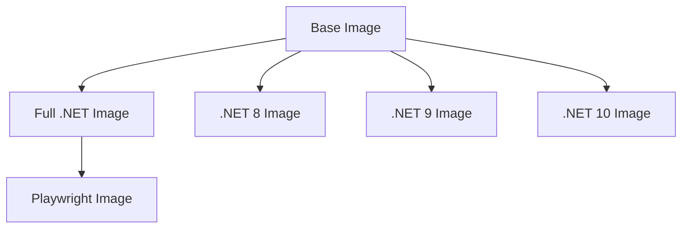

# Docker Image Variants

This repository publishes multiple Docker image variants to optimize for size and functionality:

## Base Image: `latest`
**Tag:** `ghcr.io/gordonbeeming/copilot_here:latest`

The standard copilot_here image with:
- Node.js 20
- GitHub Copilot CLI
- Git, curl, gpg, gosu

## .NET Images

### Full .NET Image: `dotnet`
**Tag:** `ghcr.io/gordonbeeming/copilot_here:dotnet`

Extends the base image with:
- .NET 8 SDK
- .NET 9 SDK
- .NET 10 SDK

### .NET 8 Image: `dotnet-8`
**Tag:** `ghcr.io/gordonbeeming/copilot_here:dotnet-8`

Extends the base image with:
- .NET 8 SDK

### .NET 9 Image: `dotnet-9`
**Tag:** `ghcr.io/gordonbeeming/copilot_here:dotnet-9`

Extends the base image with:
- .NET 9 SDK

### .NET 10 Image: `dotnet-10`
**Tag:** `ghcr.io/gordonbeeming/copilot_here:dotnet-10`

Extends the base image with:
- .NET 10 SDK

## Playwright Image: `dotnet-playwright`
**Tag:** `ghcr.io/gordonbeeming/copilot_here:dotnet-playwright`

Extends the **Full .NET Image** with:
- Playwright (latest version)
- Chromium browser with all dependencies
- System libraries for browser automation

**Use Case:** Web testing, browser automation, checking published web content

## Build Dependency Chain



## Version Tags

Each image variant is also tagged with the commit SHA for reproducibility:
- `ghcr.io/gordonbeeming/copilot_here:sha-<commit>`
- `ghcr.io/gordonbeeming/copilot_here:dotnet-sha-<commit>`
- `ghcr.io/gordonbeeming/copilot_here:dotnet-8-sha-<commit>`
- `ghcr.io/gordonbeeming/copilot_here:dotnet-9-sha-<commit>`
- `ghcr.io/gordonbeeming/copilot_here:dotnet-10-sha-<commit>`
- `ghcr.io/gordonbeeming/copilot_here:dotnet-playwright-sha-<commit>`

## Image Management

You can configure the default image tag to use (e.g., `dotnet`, `dotnet-playwright`, or a specific SHA) so you don't have to pass flags every time.

```text
IMAGE MANAGEMENT:
  --list-images     List all available Docker images
  --show-image      Show current default image configuration
  --set-image <tag> Set default image in local config
  --set-image-global <tag> Set default image in global config
  --clear-image     Clear default image from local config
  --clear-image-global Clear default image from global config
```
